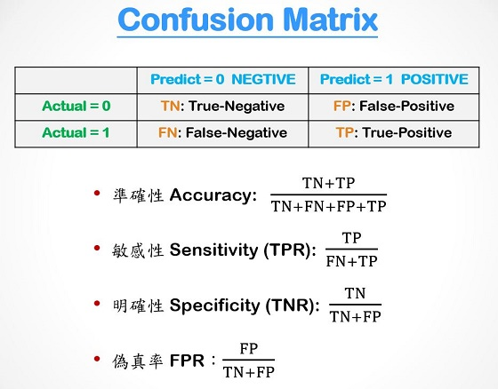
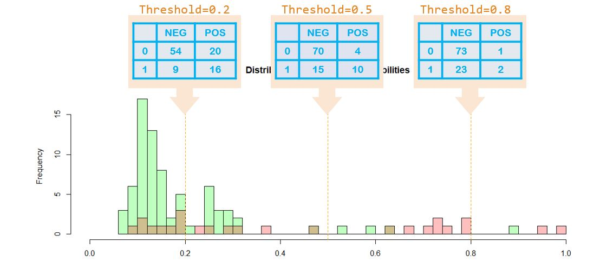
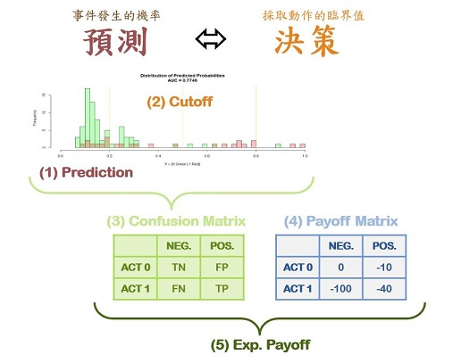
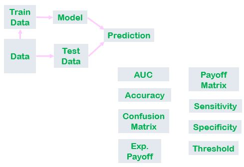

```{r echo=T, message=F, cache=F, warning=F}
rm(list=ls(all=T))
options(digits=4, scipen=12)
library(dplyr); library(ggplot2)
```


- - -

### 【A】 Definitions

#### 機率、勝率(Odd)、Logit

+ Odd =  $p/(1-p)$

+ Logit = $log(odd)$ = $log(\frac{p}{1=p})$

+ $o = p/(1-p)$ ; $p = o/(1+o)$ ;  $logit = log(o)$

```{r fig.height=3.6, fig.width=7}
par(cex=0.8, mfcol=c(1,2))
curve(x/(1-x), 0.02, 0.98, col='cyan',lwd=2, main='odd')
abline(v=seq(0,1,0.1), h=seq(0,50,5), col='lightgray', lty=3)
curve(log(x/(1-x)), 0.005, 0.995, lwd=2, col='purple', main="logit")
abline(v=seq(0,1,0.1), h=seq(-5,5,1), col='lightgray', lty=3)

```

#### Logistic Function & Logistic Regression

+ Linear Model: $y = f(x) = b_0 + b_1x_1 + b_2x_2 + ...$

+ General Linear Model(GLM): $y = Link(f(x))$ 

+ Logistic Regression: $logit(y) = log(\frac{p}{1-p}) = f(x) \text{ where } p = prob[y=1]$ 

+ Logistic Function: $Logistic(F_x) = \frac{1}{1+Exp(-F_x)} = \frac{Exp(F_x)}{1+Exp(F_x)}$

```{r  fig.width=4, fig.height=4}
par(cex=0.8)
curve(1/(1+exp(-x)), -5, 5, col='blue', lwd=2,main="Logistic Function",
      xlab="f(x): the logit of y = 1", ylab="the probability of y = 1")
abline(v=-5:5, h=seq(0,1,0.1), col='lightgray', lty=2)
abline(v=0,h=0.5,col='pink')
points(0,0.5,pch=20,cex=1.5,col='red')
```

【**Q**】What are the definiion of `logit` & `logistic function`? What is the relationship between them?
A:logit:f(x),ln(odd),ln(p/(1-p))	+A:logit:log(p/1-p)
  logistic function 把logit變成odd


<br>

- - -

### 【B】`glm(, family=binomial)`

`glm()`的功能：在 $\{x\}$ 的空間之中，找出區隔 $y$ 的(類別)界線

```{r}
getwd()
Q = read.csv("./data/quality.csv")  # Read in dataset
glm1 = glm(PoorCare~OfficeVisits+Narcotics, Q, family=binomial)
summary(glm1)
```

```{r}
b = coef(glm1); b   # extract the regression coef
```

Given `OfficeVisits=3, Narcotics=4`, what are the predicted logit, odd and probability?
```{r}
logit = sum(b * c(1, 3, 4))
odd = exp(logit)
prob = odd/(1+odd)
c(logit=logit, odd=odd, prob=prob)

```

【**Q**】What if `OfficeVisits=2, Narcotics=3`?
```{r}
logit = sum(b * c(1, 2, 3))
odd = exp(logit)
prob = odd/(1+odd)
c(logit=logit, odd=odd, prob=prob)

```

We can plot the line of `logit = 0` or `prob = 0.5` on the plane of $X$
```{r fig.width=3.6, fig.height=3.6}
par(cex=0.8)
plot(Q$OfficeVisits, Q$Narcotics, col=1+Q$PoorCare,pch=20)
abline(-b[1]/b[3], -b[2]/b[3])
```

Furthermore, we can translate probability, logit and coefficents to intercept & slope ...

$$f(x) = b_1 + b_2 x_2 + b_3 x_3 = g \Rightarrow  x_3 = \frac{g - b_1}{b_3} - \frac{b_2}{b_3}x_2$$


```{r  fig.width=3.6, fig.height=3.6}
p = seq(0.1,0.9,0.1)
logit = log(p/(1-p))
data.frame(prob = p, logit)
```

then mark the contours of proabilities into the scatter plot 
```{r  fig.width=3.6, fig.height=3.6}
par(cex=0.7)
plot(Q$OfficeVisits, Q$Narcotics, col=1+Q$PoorCare,
     pch=20, cex=1.3, xlab='X2', ylab='X3')
for(g in logit) {
  abline((g-b[1])/b[3], -b[2]/b[3], col=ifelse(g==0,'blue','cyan')) }
```

【**Q**】What do the blue/cyan lines means?
A:機率為0.1~0.9的線


【**Q**】Given any point in the figure above, how can you tell its (predicted) probability approximately?
A:我們可以畫一條機率為0.5的線，
點若位在線的右方機率>0.5
位於線的左方機率<0.5

<br>

- - -

### 【C】The Confusion Matrix





<br>

- - -
### 【D】The Distribution of Predicted Probability (DPP)

Confusion matrix is not fixed. It changes by `Threshold` ...




```{r}
library(caTools)
DPP2 = function(pred,class,tvalue,breaks=0.01) {
  mx = table(class == tvalue, pred > 0.5) 
  tn = sum(class != tvalue & pred <= 0.5)
  fn = sum(class == tvalue & pred <= 0.5)
  fp = sum(class != tvalue & pred > 0.5)
  tp = sum(class == tvalue & pred > 0.5)
  acc = (tn + tp)/length(pred)
  sens = tp/(fn+tp)
  spec = tn/(tn+fp)
  auc = colAUC(pred,class)
  data.frame(pred,class) %>% 
    ggplot(aes(x=pred, fill=class)) +
    geom_histogram(col='gray',alpha=0.5,breaks=seq(0,1,breaks)) +
    xlim(0,1) + theme_bw() + xlab("predicted probability") + 
    ggtitle(
      sprintf("Distribution of Prob[class = \'%s\']", tvalue),
      sprintf("AUC=%.3f, Acc=%.3f, Sens=%.3f, Spec=%.3f",
              auc, acc, sens, spec) ) 
  }

```

```{r fig.width=8, fig.height=2.5}
N1 = 300; N2 = 100
DPP2(pred = c(rnorm(N1,0.125,0.03), rnorm(N2,0.375,0.03)),
     class = c(rep('B',N1), rep('A',N2)), 
     tvalue = 'A')
```

【**Q**】Is it possible to have `AUC = ACC = SENS = SPEC = 1`? Can you modify the code to make it happen?

```{r fig.width=8, fig.height=2.5}
N1 = 300; N2 = 100
DPP2(pred = c(rnorm(N1,0.1,0.03), rnorm(N2,0.6,0.03)),
     class = c(rep('B',N1), rep('A',N2)), 
     tvalue = 'A')


```


【**Q**】Is it possible to have `AUC = ACC = SENS = SPEC = 0`? Can you modify the code to make that happen?

A:AUC不可能<0.5,Acc、Sens、Spec可以是0
```{r fig.width=8, fig.height=2.5}
N1 = 300; N2 = 100
DPP2(pred = c(rnorm(N1,0.8,0.03), rnorm(N2,0.2,0.03)),
     class = c(rep('B',N1), rep('A',N2)), 
     tvalue = 'A')
```
<br>

- - -
### 【E】Modeling Expert

#### E1: Random Split
```{r}
set.seed(88)
split = sample.split(Q$PoorCare, SplitRatio = 0.75)
table(split) %>% prop.table()
table(y = Q$PoorCare, split) %>% prop.table(2)
```

```{r}
TR = subset(Q, split == TRUE)
TS = subset(Q, split == FALSE)
```

#### E2: Build Model
```{r}
glm1 = glm(PoorCare ~ OfficeVisits + Narcotics, TR, family=binomial)
summary(glm1)
```

#### E3: Prediction & Evaluation
```{r}
pred = predict(glm1, type='response')
mx = table(TR$PoorCare, pred > 0.5); mx
c(accuracy = sum(diag(mx))/sum(mx),
  sensitivity = mx[2,2]/sum(mx[2,]),
  specificity = mx[1,1]/sum(mx[1,]))
```

#### E4: ROC & AUC
```{r fig.width=5, fig.height=5}
#install.packages('ROCR')
library(ROCR)
ROCRpred = prediction(pred, TR$PoorCare)
ROCRperf = performance(ROCRpred, "tpr", "fpr")
par(cex=0.8)
plot(ROCRperf, colorize=TRUE, print.cutoffs.at=seq(0,1,0.1))
```

```{r}
as.numeric(performance(ROCRpred, "auc")@y.values)
caTools::colAUC(pred, TR$PoorCare)
```

<br>

- - -
### 【F】Framingham Heart Study

```{r}
source("DPP.R")
```

#### F1: Reading & Splitting
```{r}
F = read.csv("./data/framingham.csv")
set.seed(1000)
split = sample.split(F$TenYearCHD, SplitRatio = 0.65)
TR = subset(F, split==TRUE)
TS = subset(F, split==FALSE)
```

#### F2: Logistic Regression Model
```{r}
glm2 = glm(TenYearCHD ~ ., TR, family=binomial)
summary(glm2)
```

#### F3: Prediction & Evaluation
```{r}
pred = predict(glm2, TS, type="response")
y = TS$TenYearCHD[!is.na(pred)]             # remove NA
pred = pred[!is.na(pred)]

mx = table(y, pred > 0.5); mx
c(accuracy = sum(diag(mx))/sum(mx),
  sensitivity = mx[2,2]/sum(mx[2,]),
  specificity = mx[1,1]/sum(mx[1,]))
```

#### F4: AUC & DPP
```{r fig.width=7, fig.height=2.4}
par(cex=0.7)
auc = DPP(pred, y, 1, b=seq(0,1,0.02))  # 0.74211
```

#### F5: Expected Result & Optimization





```{r fig.width=5, fig.height=4}
payoff = matrix(c(0,-100,-10,-60),2,2) 
cutoff = seq(0.02, 0.64, 0.01)

result = sapply(cutoff, function(p) sum(table(y,pred>p)*payoff) )


i = which.max(result)
par(cex=0.7)
plot(cutoff, result, type='l', col='cyan', lwd=2, main=sprintf(
  "Optomal Expected Result: $%d @ %.2f",result[i],cutoff[i]))
abline(v=seq(0,1,0.05),h=seq(-23000,-17000,500),col='lightgray',lty=3)
abline(v=cutoff[i],col='red')


```

【**Q**】如果什麼都不做，期望報酬是多少？
```{r}
payoff = matrix(c(0,-100,-10,-60),2,2) 
cutoff = seq(0.02, 0.7296, 0.01)


result = sapply(cutoff, function(p) sum(table(y,pred>p)*payoff) )


i = 71
par(cex=0.9)
plot(cutoff, result, type='l', col='cyan', lwd=2, main=sprintf(
  "Optomal Expected Result: $%d @ %.2f",result[i],cutoff[i]))
abline(v=seq(0,1,0.05),h=seq(-23000,-17000,500),col='lightgray',lty=3)
abline(v=0.7,col='red')


```

【**Q**】如果每位病人都做呢？
```{r}
payoff = matrix(c(0,-100,-10,-60),2,2) 
cutoff = seq(0.02, 0.7296, 0.01)


result = sapply(cutoff, function(p) sum(table(y,pred>p)*payoff) )


i = 1
par(cex=0.9)
plot(cutoff, result, type='l', col='cyan', lwd=2, main=sprintf(
  "Optomal Expected Result: $%d @ %.2f",result[i],cutoff[i]))
abline(v=seq(0,1,0.05),h=seq(-23000,-17000,500),col='lightgray',lty=3)
abline(v=0.02,col='red')

```

【**Q**】以上哪一種做法期望報酬比較高？
全不做比較好，期望值是-19810，比全做還高

【**Q**】在所有的商務情境都是這種狀況嗎？
不是

【**Q**】你可以模擬出「全做」比「全不做」還要好的狀況、並舉出一個會發生這種狀況的商務情境嗎？

投資新創公司
投資失敗不會賠太多成本
投資成功可能賺很多回來
payoff:
     [,1] [,2]
[1,]    0  -10
[2,]    0  100


```{r}
payoff = matrix(c(0,0,-10,100),2,2) 

cutoff = seq(0.02, 0.7296, 0.01)


result = sapply(cutoff, function(p) sum(table(y,pred>p)*payoff) )


i = 1
par(cex=0.9)
plot(cutoff, result, type='l', col='cyan', lwd=2, main=sprintf(
  "Optomal Expected Result: $%d @ %.2f",result[i],cutoff[i]))
abline(v=seq(0,1,0.05),h=seq(-23000,-17000,500),col='lightgray',lty=3)
abline(v=0.02,col='red')
```

<br>

#### F6: Simulation
```{r fig.width=6, fig.height=6}
library(manipulate)
p0 = par(mfrow=c(2,1),cex=0.8)
manipulate({
  Y0 = -22000; Y1 = -12000
  mx = matrix(c(true_neg, false_neg, false_pos, true_pos),2,2) 
  cx = seq(0.02, 0.64, 0.01)
  rx = sapply(cx, function(p) sum(table(y, pred>p)*mx) )
  i = which.max(rx)
  plot(cx, rx, type='l',col='cyan',lwd=2,main=sprintf(
    "Optomal Expected Result: $%d @ %.2f, T:%d",rx[i],cx[i],sum(pred>cx[i])),
    ylim=c(Y0,Y1))
  abline(v=cx[i],col='red')
  abline(v=seq(0,1,0.1),h=seq(Y0,Y1,2000),col='lightgray',lty=3)
  DPP(pred, y, 1, b=seq(0,1,0.02))
  abline(v=cx[i],col='red')
  },
  true_neg  = slider(-100,100,0,step=5),
  false_neg = slider(-100,100,-100,step=5),
  false_pos = slider(-100,100,-10,step=5),
  true_pos  = slider(-100,100,-60,step=5)
  ) 
par(p0)
```


【**Q**】有五種成本分別為 `$5, $10, $15, $20, $30` 的藥，它們分別可以將風險成本從 `$100` 降低到 `$70, $60, $50, $40, $25`，哪一種藥的期望效益是最大的呢？
```{r}
payoff = matrix(c(0,-100,-5,-70),2,2) 
cutoff = seq(0.02, 0.7296, 0.01)

table(y,pred>0.02) 
sum(table(y,pred>0.02)*payoff)
sum(table(y,pred>0.03)*payoff)
class(result)


result = sapply(cutoff, function(p) sum(table(y,pred>p)*payoff) )


i = which.max(result)
par(cex=0.9)
plot(cutoff, result, type='l', col='cyan', lwd=2, main=sprintf(
  "Optomal Expected Result: $%d @ %.2f",result[i],cutoff[i]))
abline(v=seq(0,1,0.05),h=seq(-23000,-17000,500),col='lightgray',lty=3)
abline(v=0.14,col='red')

```


```{r}
# (5,70) -17415, 0.14
# (10,60) -17500, 0.2
# (15,50) -17450,0.2
# (20,40) -17400, 0.2
# (30,25) -17655, 0.22
print('第五種')
```

<br>

- - -
### 【G】分析流程：資料、模型、預測、決策




<br><br><br><br><br>


